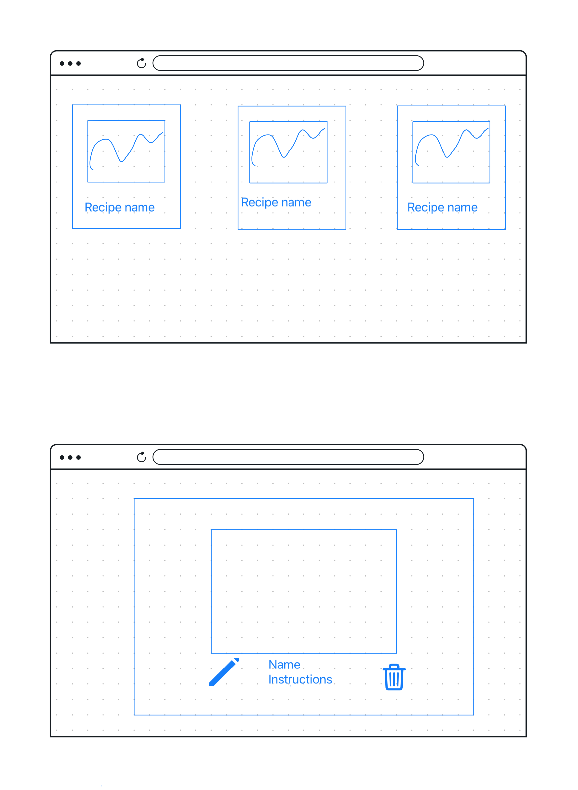
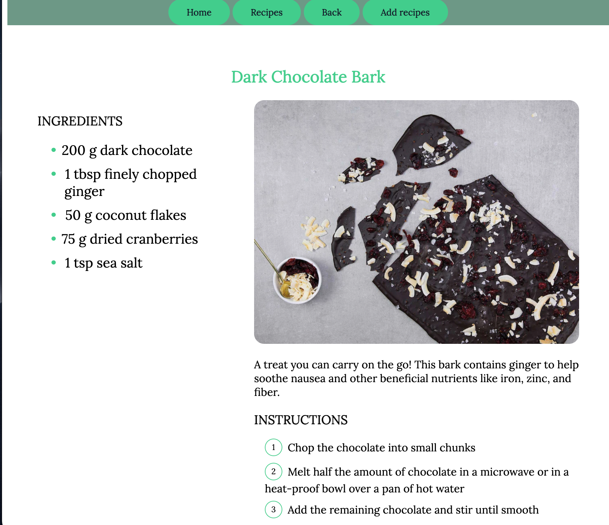
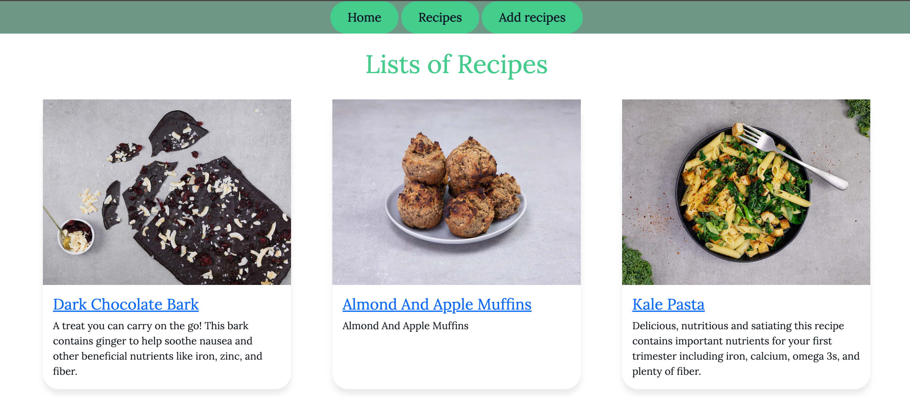

# Name of the app
## Recipe 

## A description of the app. 
This web app is a full CRUD app which can create, read update and delete. Ypu can add a new receipre to the collection of recipes. You can modifiy the list and update with a newly updated list. You can delete one recipe at a time. A person can use this app to prepare food like a world-class chef.

## Background

## WIREFRAM

## Screenshot(s)

## index 
- in this page you will see the list of recipe

## show
- in this page you will see the detail of the recipe that includes the ingridents, instructions, and edit and delete button

## Technologies Used:
- HTML
- CSS
- JavaScript
- EJS
- node
- Express
